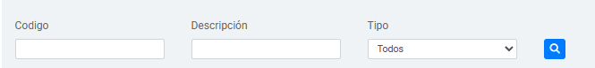

# Busqueda de CUPS

Busquedas y obtencion de informacion para mostrar en la tabla principal

Figura 1. Vista actual de los campos

## Proceso de Búsqueda

La plataforma cuenta con campos de búsqueda específicos que permiten filtrar los registros según el codigo del CUPS, la descripcion del codigo o el tipo de CUPS. A continuación, se describe el funcionamiento de cada campo y los botones de búsqueda disponibles.

### Campos de Búsqueda

1. **Código**:  
   Permite buscar por **código exacto**. Ingresa el código y el sistema devolverá el resultado correspondiente.

2. **Descripción**:  
   Realiza una búsqueda **parcial** por texto. Al ingresar una palabra o fragmento, el sistema encuentra todos los **CUPS** que contengan ese texto en la descripción.

3. **Tipo**:  
    Filtra por el **tipo de acción** configurado para cada institución (ej. "Laboratorio", "Quirurgico", etc.). Los tipos disponibles son predefinidos y varían según la institución.    

### Botones de Acción

-  **Buscar**: Inicia la búsqueda en función de los filtros aplicados en los campos anteriores. Los resultados se mostrarán en pantalla según los criterios definidos.
Sino se pone informacion sobre los campos, la plataforma no buscar informacion. 

> **Nota**: Puedes usar uno, varios o todos los filtros en combinación para obtener los resultados deseados.
Ademas de que la vista traera todos los cups registrados por la institucion

---
_Lanzado apartir de la version 1.1 y sin modificacion a la fecha._