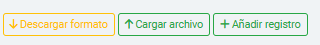

# Tabla y Funcionalidades

Vista de los CUPS en general y sus funcionalidades

## Vista de Resultados
En esta sección se visualizan los **CUPS** y su parametrización. La tabla presenta los siguientes campos:

- **Código**: El código único asignado a cada CUPS.
- **Descripción**: La descripción asociada al CUPS, que se puede buscar mediante palabras clave.
- **Tipo**: El tipo de acción configurada para el CUPS (por ejemplo, "Aprobar", "Rechazar").
- **Fecha de Creación**: La fecha en que se creó el CUPS.
- **Fecha de Edición**: La última fecha en que se actualizó el CUPS.

Además, en la tabla, se incluyen las **acciones individuales** para cada registro:

- **Editar**: Permite modificar los detalles del CUPS.
> **Nota**: La modificacion de los CUPS solo permite cambiar el tipo de cups y la descripcion. Si se requiere cambiar el codigo pero asignarle la misma descripcion debera crearlo nuevamente.

> **Nota**: Para habilitar la edicion de CUPS, se debe dar clic en el boton de editar y posterior a la modificacion guardar.

<figure style={{ textAlign: 'center' }}>
  
  <figcaption style={{ fontStyle: 'italic', color: 'gray' }}>Figura 1. Vista de modificacion de un Cups</figcaption>
</figure>

- **Eliminar**: Permite eliminar el CUPS de la lista.

### Botones de Creacion

Figura 2. Botones de Carga de CUPS

En la sección de creación de CUPS, encontrarás tres botones para facilitar el proceso:

1. **Descargar Plantilla**: Este botón descarga un archivo de plantilla que te permite realizar una carga masiva de CUPS. Si necesitas el listado completo
 de los tipos de acción disponibles, puedes solicitarlos mediante un **ticket**. Alternativamente, los tipos de acción se pueden seleccionar desde el menú
 desplegable en la sección de búsqueda.

<figure style={{ textAlign: 'center' }}>
  
  <figcaption style={{ fontStyle: 'italic', color: 'gray' }}>Figura 1. Archivo plantilla de cups</figcaption>
</figure>

> **Nota**: Cuando se descarga el archivo deja un registro de muestra, recuerde eliminar esa prueba antes de cargar el archivo a la plataforma.

2. **Cargar Archivo**: Este botón te permite cargar un archivo con múltiples CUPS para realizar una carga masiva.

3. **Añadir Registro**: Este botón te permite agregar un CUPS de manera manual. Tendrás que completar los tres campos requeridos: **Código**, **Descripción** y **Tipo**.

<figure style={{ textAlign: 'center' }}>
  
  <figcaption style={{ fontStyle: 'italic', color: 'gray' }}>Figura 1. Archivo plantilla de cups</figcaption>
</figure>

---
_Lanzado apartir de la version 1.1 y sin modificacion a la fecha._
