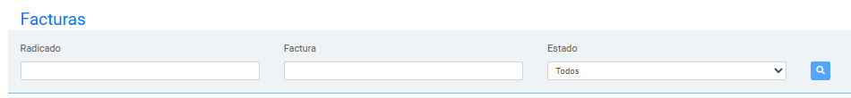

# Busqueda de Facturas

Busquedas y obtencion de informacion para mostrar en la tabla principal

  Figura 1. Vista actual de los campos

## Proceso de Búsqueda

La plataforma cuenta con campos de búsqueda específicos que permiten filtrar los registros según el numero del radicado, numero de factura o estado de las facturas.
A continuación, se describe el funcionamiento de cada campo y los botones de búsqueda disponibles.

### Campos de Búsqueda

- **Campo 1: Radicado**
  Permite buscar facturas asociadas a un radicado específico. Ingresando el número de radicado, el sistema mostrará todas las facturas relacionadas, facilitando la revisión de información agrupada por radicado.

- **Campo 2: Factura**
  Este campo permite buscar una sola factura en particular. Al ingresar el número de la factura, el sistema obtendrá y mostrará los detalles de esa factura específica.

- **Campo 3: Estado**
  El campo **Estado** es un desplegable que permite seleccionar el estado en el cual se encuentran las facturas. Los estados disponibles representan el progreso o las incidencias de una factura en el proceso.

> **Nota**: Aunque los campos dejen escribir letras, los campos **SON SOLO DE BUSQUEDA NUMERICA**, aunque se deje buscar no se obtendra ningun resultado por busquedas con letras

### Estados de las Facturas

> ⚠️ **Nota Importante**: Cuando una factura presente un ícono de **error** <i className="fa fa-exclamation" style={{ fontSize: '14px'}}></i>
, el usuario deberá enviar a reprocesar la factura para intentar resolver el problema. Al acceder a la carpeta correspondiente antes del momento del error, el usuario podrá observar una serie de subcarpetas que representan las etapas del proceso natural del robot. 
Estas subcarpetas reflejan el avance del robot hasta el punto en que ocurrió la incidencia, proporcionando información valiosa para el diagnóstico y la toma de decisiones.
> 
> Para ver los detalles completos de los íconos que se muestran en el módulo y sus distintos estados, consulte el siguiente enlace: [Estados](http://localhost:3000/docs/intro#estados-de-los-distintos-procesos).

  

### Botones de Acción

-  **Buscar**:
  Inicia la búsqueda en función de los filtros aplicados en los campos anteriores.
  Los resultados se mostrarán en pantalla según los criterios definidos. Sino se
  coloca ningun filtro el boton de lupa no se activara, es necesario que el campo
  de Radicado o el de Factura tenga informacion a buscar, **NO BUSCA SOLAMENTE POR
  ESTADO**.

> **Nota**: Puedes usar uno, varios o todos los filtros en combinación para obtener los resultados deseados.

---

_Lanzado desde la version 1.0 y sin modificacion a la fecha._
