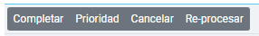
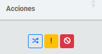

# Tabla y Funcionalidades
Vista de las facturas en general y sus funcionalidades

## Vista de Resultados
En la **Vista de Resultados**, se muestran los registros generados por la búsqueda. Esta sección permite visualizar información detallada sobre facturas de un radicado 
y su estado actual. La tabla de resultados contiene las siguientes columnas:

### Columnas de la Tabla

- **Nro**: Indicador numérico que simplemente muestra el número de fila en la lista, sin impacto en los datos.
- **Radicado**: Número del radicado que se está visualizando.
- **Fecha Creación**: Muestra la fecha en la que el registro fue cargado al sistema.
- **Aseguradora**: EPS a la cual está asociado el radicado o la factura.
- **Factura**: Número de la factura asociada al radicado, permitiendo identificar la factura específica en cuestión.
- **Ingreso**: Número de ingreso relacionado con la factura, que asocia la entrada de datos en el sistema con su factura correspondiente.
- **Estado**: Indica el estado actual de la factura, el cual puede ser alguno de los estados definidos previamente en el sistema. [Ver aquí](http://localhost:3000/docs/intro#estados-de-los-distintos-procesos) para más detalles.
- **Observación**: Último comentario o estado textual registrado por el robot durante el proceso, proporcionando contexto sobre la última acción realizada o incidencia detectada.
- **RPA**: Nombre del robot que está a cargo del procesamiento de la factura, lo cual facilita la identificación del agente de automatización responsable.
- **Re-intentos**: Cantidad de veces que la factura ha sido reprocesada debido a errores o incidencias, reflejando los intentos realizados para completar el proceso con éxito.

Este listado permite una visión completa y detallada de cada factura en su estado actual, ayudando a los usuarios a evaluar rápidamente el estado y el historial de procesamiento de cada entrada.

### Acciones Masivas

La sección **Acciones Masivas** permite a los usuarios realizar cambios en varias facturas seleccionadas en la tabla de resultados. A continuación, se describe el proceso general y los pasos que siguen estas acciones masivas.

#### Funcionamiento General de las Acciones Masivas

1. **Selección de filas**: Para realizar cualquier acción masiva, el usuario debe seleccionar al menos una fila en la tabla de resultados. 
   > **Nota**: Si no se selecciona ninguna fila, aparecerá un mensaje de advertencia para recordar al usuario la necesidad de seleccionar al menos una factura.

2. **Confirmación de la acción**: Al hacer clic en uno de los botones de acción masiva, se mostrará un mensaje de confirmación solicitando la aprobación del usuario para realizar los cambios. Este paso asegura que el usuario esté al tanto de los cambios que se aplicarán a las facturas seleccionadas.

3. **Ejecución y seguimiento de la acción**: Una vez confirmada la acción, se iniciará un proceso de ejecución que incluye un contador, el cual muestra el progreso de los cambios que se están realizando. Esto permite al usuario monitorear la acción masiva en tiempo real.

4. **Confirmación final y actualización de la página**: Al completarse el proceso, se mostrará una ventana de confirmación indicando que los cambios se han realizado correctamente. Luego, la página se actualizará automáticamente para reflejar los cambios en la tabla.

### Funcionalidades de los Botones de Acciones Masivas

  Figura 1. Vista actual de los Botones

Cada botón de acción masiva permite modificar el estado o la prioridad de las facturas seleccionadas en la tabla. A continuación, se detalla la función de cada botón:

- **Completar**: Cambia el estado de las facturas seleccionadas a "Completado por el usuario". Esta acción se utiliza para indicar que el usuario ha revisado y completado manualmente el proceso de armado de cuentas en las facturas seleccionadas.

- **Prioridad**: Este botón asigna una prioridad a las facturas para que los robots las procesen con mayor o menor urgencia. Existen tres niveles de prioridad:
  - **Bajo**
  - **Medio**
  - **Alto**

<figure style={{ textAlign: 'center' }}>
  
  <figcaption style={{ fontStyle: 'italic', color: 'gray' }}>Figura 2. Vista de modificacion de la Prioridad</figcaption>
</figure>
   > **Nota**: Asignar una gran cantidad de facturas con **Prioridad Alta** puede hacer que el robot distribuya sus recursos analizando no solo la prioridad sino también la fecha en la que fueron cargadas. Esto significa que, si demasiadas facturas tienen prioridad alta, el robot seguirá priorizando según su lógica interna, y el efecto de la prioridad puede disminuir.

- **Cancelar**: Cambia el estado de las facturas seleccionadas a "Canceladas". Esto indica que las facturas no deben ser procesadas por el robot, excluyéndolas de futuros intentos de armado.

- **Re-Procesar**: Reactiva las facturas seleccionadas, poniéndolas nuevamente en la cola de procesamiento del robot con prioridad alta. Sin embargo, existe una restricción:
- Las facturas solo pueden reprocesarse hasta **tres veces** adicionales después del primer intento, sumando un total de cuatro intentos de procesamiento. Si tras estos intentos el robot no logra completar el armado, el usuario deberá realizar el proceso de armado de manera manual.

Este conjunto de acciones masivas permite una gestión eficiente de las facturas en función de sus necesidades y del progreso automatizado en el sistema.

### Funcionalidades de los Botones de Acciones Individuales

  Figura 2. Vista actual de los Botones de acciones individuales

Cada registro de factura en la tabla cuenta con tres botones que permiten realizar acciones específicas sobre la factura seleccionada:

- **Trazabilidad**: Este botón muestra la trazabilidad completa de los pasos realizados por el robot durante el procesamiento de la factura. 
Se presenta un detalle exhaustivo paso a paso, incluyendo cada vez que el robot ha seguido el mismo camino dentro del proceso. Por lo tanto, es posible que 
algunos pasos aparezcan repetidos debido a los reintentos automáticos del robot.

- **Inconsistencia**: Al seleccionar este botón, el sistema despliega todas las inconsistencias detectadas por el robot en el proceso normal como en los reprocesos. 
No está limitado ni filtrado, por lo que incluye todas las inconsistencias encontradas en los distintos reprocesos, permitiendo al usuario visualizar cualquier
problema que haya afectado la factura.

- **Erradicar Factura**: Esta opción permite retirar una factura de un radicado, dejándola invisible para el usuario en la lista de facturas del radicado. 
Para realizar esta acción, el usuario debe proporcionar una justificación escrita explicando la razón de la erradicación, como se muestra en la **Figura 3.**
Esta justificación quedará registrada en la trazabilidad de la factura para futuras referencias.
<figure style={{ textAlign: 'center' }}>
  
  <figcaption style={{ fontStyle: 'italic', color: 'gray' }}>Figura 3. Erradicar Factura</figcaption>
</figure>

---
_Lanzado desde la version 1.0 y sin modificacion a la fecha._
