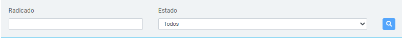

# Busqueda de RIPS
Busquedas y obtencion de informacion para mostrar en la tabla principal

  Figura 1. Vista actual de los campos

## Proceso de Búsqueda

La plataforma cuenta con campos de búsqueda específicos que permiten filtrar los registros según el numero del radicado. 
A continuación, se describe el funcionamiento de cada campo y los botones de búsqueda disponibles.

### Campos de Búsqueda

- **Campo 1: Radicado**
  Permite buscar RIPS de un radicado específico. Ingresando el número de radicado, el sistema mostrará el RIPS, facilitando la revisión de información.

- **Campo 2: Estado**
  El campo es un desplegable que permite seleccionar el estado en el cual se encuentran los Radicados. Los estados disponibles representan el progreso o las incidencias de un radicado.
  el cual puede ser alguno de los estados definidos previamente en el sistema.[Ver aquí](http://localhost:3000/docs/factura/search#estados-de-las-facturas) para más detalles sobre los estados.
  
### Botones de Acción

-  **Buscar**:
  Inicia la búsqueda en función de los filtros aplicados en los campos anteriores. Los resultados se mostrarán en pantalla según los criterios definidos. Sino se
  coloca ningun filtro el boton de lupa no se activara, es necesario que el campo de Radicado tenga informacion a buscar, **NO BUSCA SOLAMENTE POR ESTADO**.

> **Nota**: Puedes usar uno, varios o todos los filtros en combinación para obtener los resultados deseados.

---
_Lanzado desde la version 1.0 y sin modificacion a la fecha._